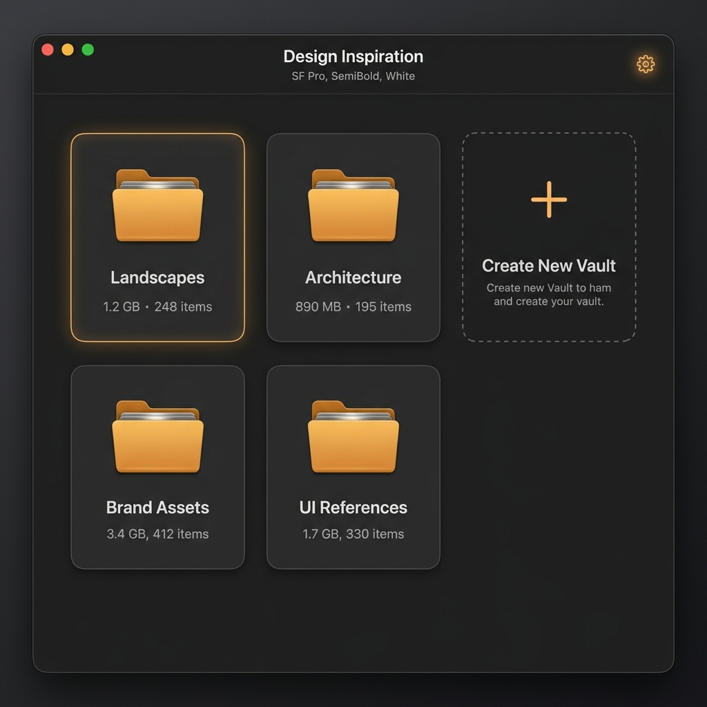
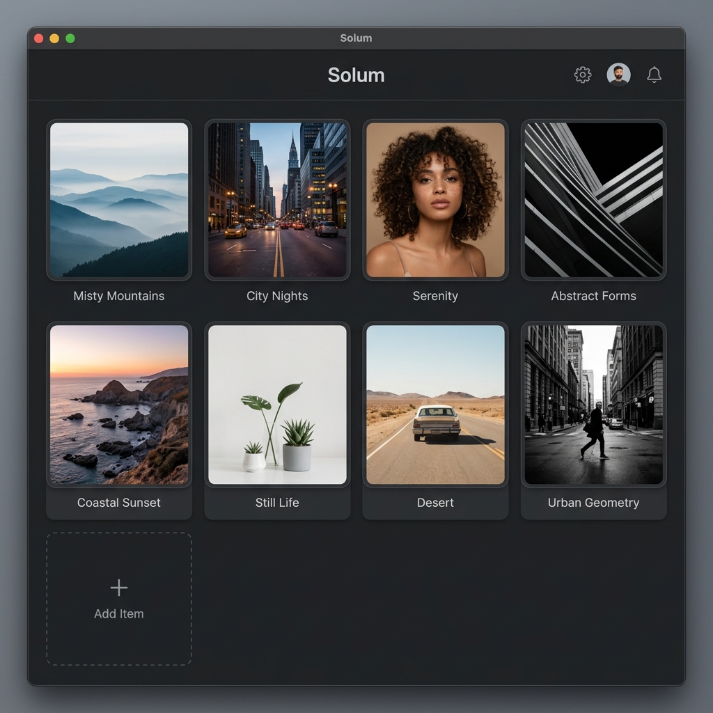
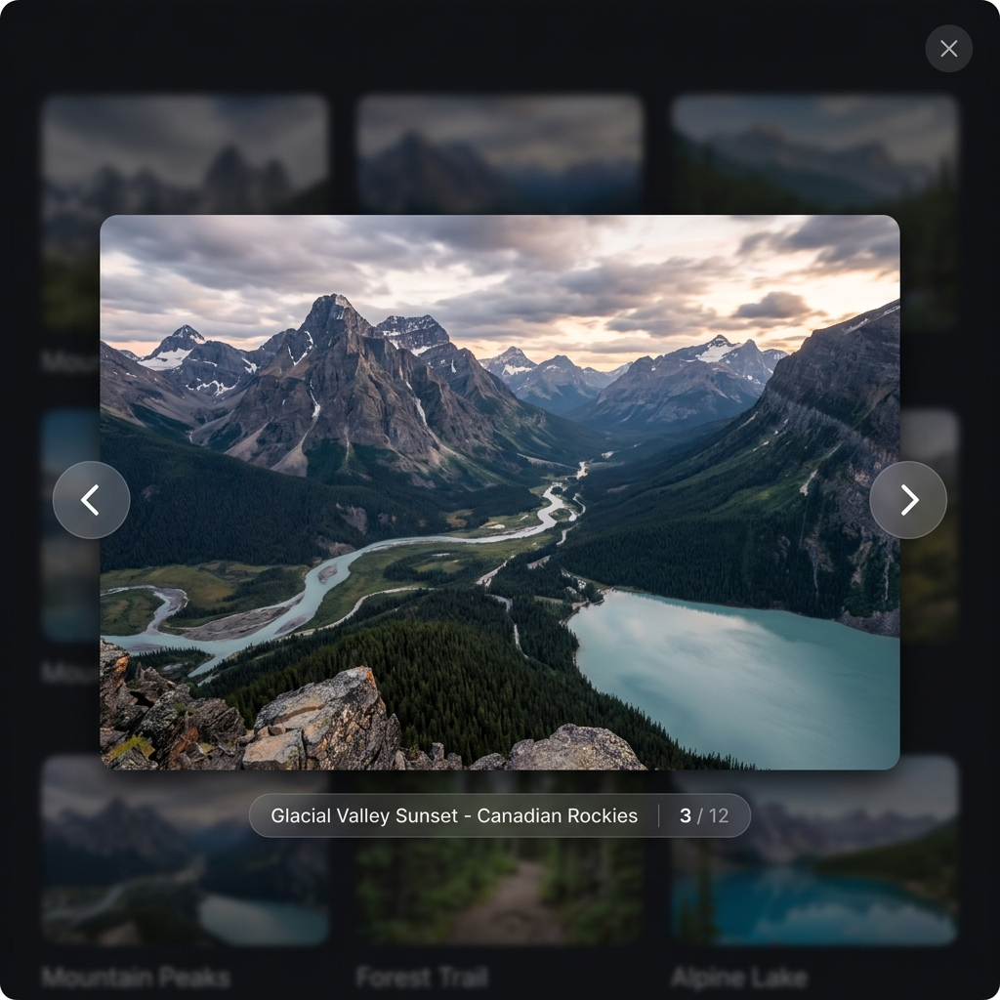

# Solum — Native Desktop Moodboard

> A minimalist, local-first moodboard application for organizing visual inspiration without distraction.

Solum is inspired by Obsidian's vault philosophy: pick any folder on your computer, and it becomes your creative workspace. Subfolders are **Vaults**, image and PDF files inside them are **Photos**. Every action writes directly to your filesystem — no cloud, no accounts, no lock-in.

Built with **React**, **TypeScript**, **Tailwind CSS v4**, and **Electron**.

---

## Screenshots

<p align="center">
  
</p>
<p align="center"><em>Vaults Dashboard — Browse and manage your workspace folders</em></p>

<br />

<p align="center">
  
</p>
<p align="center"><em>Moodboard Grid — Visual grid of all photos in a vault</em></p>

<br />

<p align="center">
  
</p>
<p align="center"><em>Lightbox — Full-screen preview with keyboard navigation</em></p>

---

## Features

- **Obsidian-Style Workspace Picker** — Open any local directory as your creative canvas.
- **Direct Filesystem Operations** — Create, rename, and delete vaults and photos. Every change is written to disk instantly.
- **Drag & Drop Import** — Drag images from your desktop or file explorer directly into a vault.
- **Lightbox with Navigation** — Click any photo for a full-screen preview. Use `←` / `→` arrow keys or the on-screen buttons to cycle through all items. Press `Esc` to close.
- **Multi-Format Support** — PNG, JPG, JPEG, GIF, SVG, WebP, and PDF files are all supported.
- **Image Fit Toggle** — Switch between `cover` (fill) and `contain` (fit) modes for thumbnails.
- **Dynamic Settings** — Adjust font size, grid density, and thumbnail size from the settings panel.
- **Dark & Light Modes** — Sleek zinc palette with system-aware theming.

---

## Getting Started

### Prerequisites

- [Node.js](https://nodejs.org/) v18 or higher
- npm

### Install

```bash
git clone https://github.com/David-bit986/solum-app.git
cd solum-app
npm install
```

### Run in Development

```bash
npm run dev
```

This starts the Vite dev server and launches Electron together.

---

## Project Structure

```
solum-app/
├── electron/
│   ├── main.ts                # Electron main process — dialogs, file ops, custom protocol
│   ├── main.test.ts           # Tests for IPC handlers and protocol resolution
│   ├── preload.ts             # Context bridge — safe window.electronAPI
│   └── path-utils.ts          # Platform-safe file URL utilities
│
├── src/
│   ├── main.tsx               # Renderer entrypoint
│   ├── App.tsx                # Router, drag-and-drop handler, state sync
│   ├── index.css              # Tailwind v4 entrypoint and design tokens
│   │
│   ├── types/
│   │   ├── solum.ts           # Shared models (Vault, Photo)
│   │   └── electron.d.ts      # IPC bridge type declarations
│   │
│   └── components/
│       ├── shell/
│       │   └── AppShell.tsx   # Navigation header, settings panel
│       └── sections/
│           ├── VaultsDashboard.tsx       # Vault grid with CRUD
│           ├── VaultsDashboard.test.tsx  # Dashboard tests
│           ├── MoodboardGrid.tsx        # Photo grid + lightbox + navigation
│           └── MoodboardGrid.test.tsx   # Moodboard tests
│
├── package.json
├── vite.config.ts
├── tsconfig.json
├── tsconfig.app.json
├── tsconfig.electron.json
└── tsconfig.node.json
```

---

## Build & Package

### Compile for production

```bash
npm run build
```

Outputs the frontend to `dist/` and Electron processes to `dist-electron/`.

### Package as executable

```bash
npm run package
```

Creates a standalone `.exe` (Windows) in the `release/` directory.

---

## Keyboard Shortcuts

| Shortcut | Action |
|----------|--------|
| `←` | Previous photo (in lightbox) |
| `→` | Next photo (in lightbox) |
| `Esc` | Close lightbox |

---

## Tech Stack

| Layer | Technology |
|-------|-----------|
| Framework | React 19 + TypeScript |
| Styling | Tailwind CSS v4 |
| Desktop | Electron 34 |
| Bundler | Vite |
| Testing | Vitest |

---

## License

MIT
